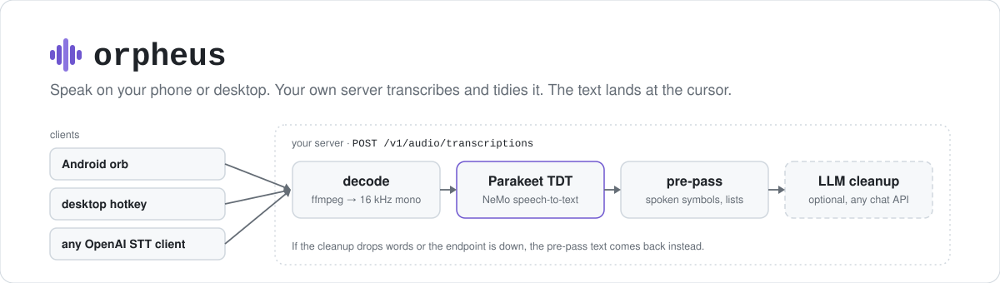

<p align="center">
  <picture>
    <source media="(prefers-color-scheme: dark)" srcset="assets/hero-dark.svg">
    
  </picture>
</p>

<p align="center">
  <a href="https://github.com/CocaKova/orpheus/releases/latest"></a>
  <a href="https://github.com/CocaKova/orpheus/actions/workflows/desktop-windows.yml"></a>
  
  
  
  <a href="LICENSE"></a>
</p>

Orpheus is a self-hosted dictation stack, my open take on cloud dictation apps like Wispr Flow.
You talk into your phone or your desktop, a server you run transcribes it with NVIDIA's Parakeet TDT
model, a local LLM tidies it (fillers out, punctuation in, "five, no, six" becomes "six"), and the
text is typed into whatever field had the cursor. No word limits and no subscription. When the
clients point at your own server, the audio and the text stay on your network.

| Piece | What it is |
|---|---|
| [`server/`](server) | OpenAI-compatible `/v1/audio/transcriptions` endpoint: Parakeet TDT speech-to-text, a deterministic formatting pass, and an optional LLM cleanup pass |
| [`android/`](android) | A floating dictation orb that shows up whenever a keyboard opens and inserts at the cursor in any app, plus a dashboard |
| [`desktop/`](desktop) | A single-file push-to-talk client for Windows and Linux: hotkey, record, paste into the focused window. See [`desktop/README.md`](desktop/README.md) |

Because the server speaks the OpenAI transcription API, any client with a configurable
speech-to-text URL works too. Point it at `http://your-host:8123`.

## Quick start

### 1. The server

You need Python 3.12, [uv](https://docs.astral.sh/uv/), ffmpeg on `PATH`, and a machine with an
NVIDIA GPU. The commands below install a CUDA 13.0 build of PyTorch; use the index URL that matches
your CUDA version.

```bash
cd server
uv venv --python 3.12 .venv
uv pip install --python .venv/bin/python \
  --index-url https://download.pytorch.org/whl/cu130 \
  --extra-index-url https://pypi.org/simple "torch==2.11.*"
uv pip install --python .venv/bin/python -r requirements.txt
.venv/bin/python orpheus_server.py
```

The first start downloads `nvidia/parakeet-tdt-0.6b-v2` (about 2.5 GB). Once `/healthz` says
`"status": "ok"`, try a recording:

```bash
curl -s http://localhost:8123/v1/audio/transcriptions \
  -F file=@recording.m4a -F response_format=verbose_json
```

Anything ffmpeg can read is accepted. `clean=false` skips the LLM pass and returns the
recognizer's text after the formatting pre-pass. A sample systemd user unit is in
[`server/orpheus.service`](server/orpheus.service); adjust its paths to where you cloned the repo.

The LLM cleanup talks to any OpenAI-compatible chat endpoint (`ORPHEUS_CLEAN_URL`, default
`http://127.0.0.1:8000/v1`) and uses the first model that endpoint lists unless you set
`ORPHEUS_CLEAN_MODEL`. Without that endpoint, every request falls back to the pre-pass text, so
dictation still works, only less polished.

### 2. A client

- **Android:** install the APK from the [latest release](https://github.com/CocaKova/orpheus/releases/latest),
  open Orpheus and work through the Setup card: microphone access, the accessibility service
  (the orb), and your server URL. The test-connection button tells you the URL works before you
  dictate.
- **Windows:** download `OrpheusDesktop.exe` from the same release, set `url` in its config and
  press Win+H. Details in [`desktop/README.md`](desktop/README.md).
- **Linux desktop:** run `desktop/orpheus_desktop.py` from source (Python 3.11+). Same README.
- **Anything else** that takes an OpenAI-compatible STT URL: point it at `http://your-host:8123`.

Releases can trail `main`. If you want the newest fixes, build from source (see [Building](#building)).

## What the server does with your words

1. **Decode and transcribe.** ffmpeg converts the upload to 16 kHz mono WAV and Parakeet TDT
   transcribes it. One transcription runs on the GPU at a time.
2. **Spoken symbols.** A deterministic pre-pass ([`server/formatting.py`](server/formatting.py))
   turns "open paren", "new line", "exclamation point", "underscore", "slash", "dash dash",
   "quote … end quote", "smiley face" and the rest of the usual dictation vocabulary into the
   symbols themselves.
3. **LLM cleanup (optional).** The model handles the context-dependent cases
   ("sarah at acme dot com" → `sarah@acme.com`, "hashtag local peer" → `#localpeer`), turns spoken
   code and prices into `get_user(user_id)` and `$25.50`, strips fillers, applies self-corrections
   and fixes casing.
4. **Content guard.** The answer is compared with what was said. If the model dropped words, it
   gets one more try, and after that the pre-pass text is returned instead. A cleanup pass can't
   lose your words.
5. **Lists and punctuation.** Name a set of things ("from the store I need eggs, milk, bread and
   cheese"), count them off ("first… second…", "number one…", "step one…") or say "bullet point"
   between items, and you get the lead-in on its own line with a colon and one item per line:
   bullets for a plain set, `1.` `2.` when you counted. Two things joined by "and" stay a sentence,
   and so does a list buried inside a longer one. The mark you ended a sentence on is restored if
   the model drops it.
6. **Fit to the cursor.** Clients can say where the text is going (see below), so the result
   starts lowercase mid-sentence, skips list formatting in a terminal, and in chat apps drops the
   full stop from a lone sentence the way people type ("on my way"). Questions and exclamations keep
   their mark.

<details>
<summary>Request fields</summary>

`POST /v1/audio/transcriptions`, multipart form:

| Field | Meaning |
|---|---|
| `file` | The audio. Any format ffmpeg reads. |
| `response_format` | `json` (default, `{"text": …}`), `text`, or `verbose_json` (adds `raw_text`, `pre_text`, timings, `cleaned`, `guard`, `style`) |
| `clean` | `true` / `false`. Default comes from `ORPHEUS_CLEAN_DEFAULT`. |
| `context_before`, `context_after` | Text left and right of the cursor in the target field (the server keeps the last 2000 / first 500 characters) |
| `app` | Target app package or id. Picks a style from the built-in map (common chat, email and terminal apps) plus `ORPHEUS_APP_STYLES`. |
| `style` | `auto`, `prose`, `message`, `email` or `code`. `code` gets no list formatting and no capitalisation. |
| `trailing_period` | `keep` or `drop`: the chat-app full stop convention, per request |
| `prompt` | OpenAI-style spelling hint: extra names and terms, same format as `ORPHEUS_DICTIONARY` |
| `model` | Accepted for OpenAI compatibility and ignored |

Other endpoints: `GET /v1/models` and `GET /healthz` (status, version, model, whether CUDA is
available, the cleanup URL).

</details>

## Configuration

The server reads environment variables only. All of these are optional.

| Variable | Default | Meaning |
|---|---|---|
| `ORPHEUS_PORT` | `8123` | Listen port. The server binds `0.0.0.0`. |
| `ORPHEUS_MODEL` | `nvidia/parakeet-tdt-0.6b-v2` | NeMo ASR model name |
| `ORPHEUS_CLEAN_DEFAULT` | `true` | Run the LLM pass unless the request says `clean=false` |
| `ORPHEUS_CLEAN_URL` | `http://127.0.0.1:8000/v1` | OpenAI-compatible base URL for the cleanup model |
| `ORPHEUS_CLEAN_MODEL` | first model listed by `/models` | Cleanup model id |
| `ORPHEUS_CLEAN_TEMP` | `0.2` | Cleanup sampling temperature |
| `ORPHEUS_DICTIONARY` | empty | Comma-separated names and terms to spell right, e.g. `"Ada, Keryx, DGX Spark"`. `heard=meant` pairs (`Currics=Keryx`) are fixed before the LLM sees the text. |
| `ORPHEUS_APP_STYLES` | empty | `pkg=style, pkg=style` additions to the built-in app → style map |
| `ORPHEUS_KEEP_PERIOD` | `false` | Keep the full stop on a lone sentence in chat apps |
| `ORPHEUS_API_KEY` | empty | If set, `/v1/*` requires `Authorization: Bearer <key>` |
| `ORPHEUS_MAX_UPLOAD_MB` | `64` | Reject larger uploads |
| `ORPHEUS_LOG_TEXT` | `false` | Log transcript previews. Off means the log shows a word count only. |

## The Android app

- **The orb.** An accessibility service watches for a keyboard opening in any app and floats a
  draggable orb beside it. Tap to record (the glow follows your voice), tap again to stop, or press
  and hold to record only while held. The transcript lands at the cursor of the focused field,
  spaced to fit the words around it, with a green check and a haptic tick. The orb snaps to the
  screen edge after a drag and rests dim when idle.
- **Context.** The words next to your cursor and the app you're in travel with the audio (Settings →
  Match the text around the cursor, on by default), along with your personal dictionary.
- **Nothing is lost.** If the server is reloading or unreachable, the recording is kept: the orb
  turns amber, a tap retries, a hold records fresh, and the dashboard offers the same take with
  Retry and Discard. HTTP 503 (server restarting) is retried automatically for up to 40 seconds.
- **Dashboard.** A live preview of the orb; words dictated today, in the last 7 days and all time,
  with an estimate of the time saved over typing; and a local history of every transcript with the
  app it went into and what the recognizer heard before cleanup. Tap to copy again, long-press to
  delete, export through the share sheet. Transcripts are kept 30 days by default (7, 30 or 90 days,
  forever, or not at all). Word-count stats are kept regardless.
- **Any OpenAI-compatible STT.** Point it at your Orpheus server, or at OpenAI or Groq, with
  optional API key and model fields. "Skip AI cleanup" pastes the raw transcription instead.

**Why an accessibility service?** It's how the orb knows a keyboard opened and how the transcript
gets into a text field of another app. Orpheus reads the text around your cursor in the field
you're dictating into, and only while "Match the text around the cursor" is on. It sends that text
with the audio to the server you configured and stores none of it. Transcripts and word counts
live in a local file on the device. Backup is disabled, and clipboard entries are flagged sensitive.

**Permissions** (from the manifest): microphone, internet, foreground services (microphone and the
keep-alive), notifications, vibration, and the request to ignore battery optimisation, plus the
accessibility service you enable yourself. No Google Play services and no analytics libraries.

<details>
<summary>If the orb goes missing</summary>

The orb is built to stay put: one overlay window for the life of the service, three independent
"you're typing" signals (the keyboard window, the IME insets, a focused text field), a grace period
before it hides, and a heartbeat that re-checks while the screen is on. What it can't survive is
Android stopping the accessibility service itself, so the app also:

- runs a silent, collapsed **keep-alive** foreground service (Settings → Staying available → Stay
  running; on by default) that marks Orpheus as foreground work so app sleepers leave it alone;
- asks for **unrestricted battery**, one tap in the dashboard when it isn't granted yet;
- keeps a **service log** (Settings → Staying available) with every connect, disconnect, crash and
  refusal, so a drop-out has a timestamp and a reason.

The orb stays off the lock screen. It is hidden whenever the screen is off or the keyguard is up,
and a take still recording when the screen goes off is finished and transcribed rather than left
running. The hide is a snap, not a fade: with the display off there are no frames for an animation
to run on, so a fade would leave the orb painted on the lock screen. The heartbeat re-asserts it
by reading the screen state itself. Text is never inserted while the keyguard is up; it goes to the
clipboard instead.

Samsung phones also need Orpheus in *Never sleeping apps* (Battery → Background usage limits). The
dashboard's status line turns amber when the service is enabled but not running; tapping it opens
accessibility settings, where turning the service off and on brings the orb back.
`adb logcat -s Orpheus` shows the same signals live.

</details>

## Limitations

- **Server hardware.** The server is set up for an NVIDIA GPU with CUDA (see the PyTorch index in
  the quick start). CPU-only and other GPUs are untested.
- **No auth by default.** The server listens on all interfaces with no API key. Run it on a network
  you trust, or set `ORPHEUS_API_KEY` and put the same key in each client. The Android app allows
  plain HTTP so it can reach a LAN server.
- **English.** The default model is Parakeet TDT 0.6B v2, an English model, and the spoken-symbol
  and list rules are English.
- **Cleanup quality depends on your LLM.** The guard keeps a weak model from losing words, but it
  can't make a weak model format well.
- **Android.** Needs Android 8.0 (API 26) or newer. Accessibility overlays behave differently across
  vendors; the Samsung note above is the one I know about.
- **Desktop.** Windows and Linux (X11 and Wayland). No macOS client.
- **Unsigned binaries.** The Windows exe is unsigned, so SmartScreen warns the first time. The
  release APK is signed with a debug key.

This is a personal project, provided as is under the MIT license. Not affiliated with or endorsed by
NVIDIA, OpenAI or Wispr. Parakeet TDT is NVIDIA's model and is downloaded from Hugging Face under its
own license.

## Building

**Server tests** (no pytest needed):

```bash
cd server && python test_formatting.py
```

**Android:** `cd android && ./gradlew assembleRelease`. The APK lands in
`app/build/outputs/apk/release/`. Release builds are signed with the debug key of the machine that
builds them, so your build won't install over the release APK (or the other way round) without
uninstalling first.

**Windows exe:** the [`desktop-windows`](.github/workflows/desktop-windows.yml) workflow builds
`OrpheusDesktop.exe` with PyInstaller from `desktop/OrpheusDesktop.spec`, smoke-tests it, and
attaches it to the release on every `v*` tag.

## License

[MIT](LICENSE)
